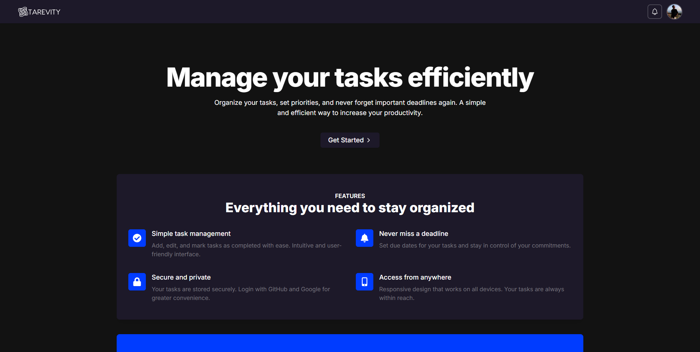
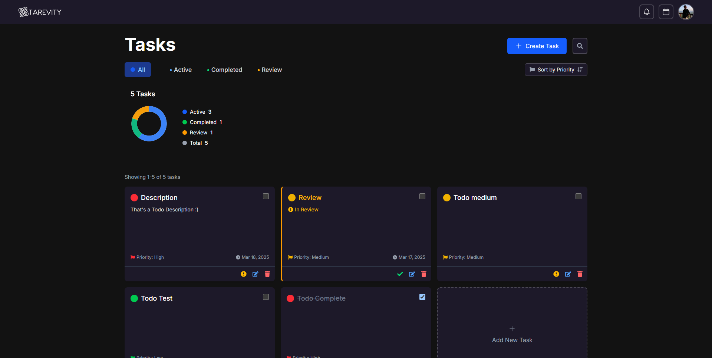
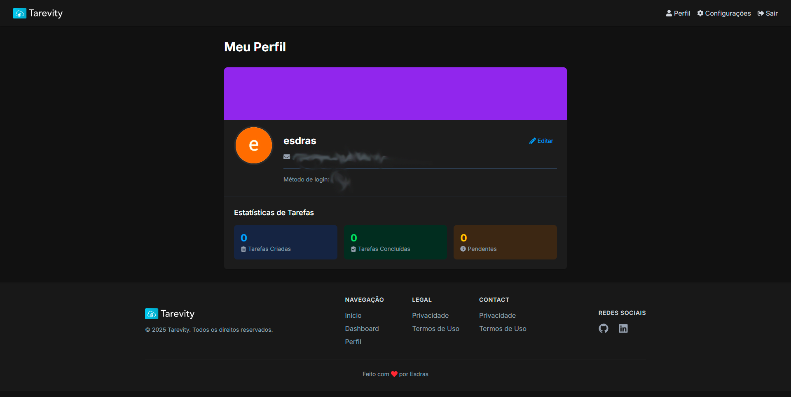

# Tarevity - Task Manager


Tarevity is a modern task management application built with Next.js 15, React 19, TypeScript, and Supabase. The application provides an intuitive and secure interface to help users organize their daily tasks with efficiency and style.

## 🚀 Features

- ✅ Complete task management system (create, edit, delete, mark as completed)
- 🔄 Advanced task filtering by status, priority, and text search
- 🔑 Multi-provider authentication (Email/Password, Google, GitHub) with NextAuth.js
- 🔒 Robust security features including password strength evaluation and breach checking
- 🔄 Password recovery with secure token-based system
- 🌓 Light/Dark modes with system preference detection
- 📱 Fully responsive design optimized for all devices
- 📊 Personal task statistics dashboard
- 👤 User profile management
- 🛡️ Comprehensive security headers and CSP implementation
- 🔒 Rate limiting on sensitive endpoints
- ⚡ Server-side rendering for improved performance and SEO

## 🛠️ Technologies Used

### Frontend
- **Framework**: Next.js 15 with App Router
- **UI Library**: React 19
- **Styling**: Tailwind CSS v4
- **Type Safety**: TypeScript
- **Icons**: react-icons
- **Notifications**: react-toastify
- **Date Handling**: date-fns
- **Theme Management**: next-themes

### Backend & Database
- **Authentication**: NextAuth.js v4
- **Database**: Supabase (PostgreSQL)
- **Data Validation**: Zod
- **Form Management**: React Hook Form
- **Password Hashing**: bcryptjs
- **Rate Limiting**: Redis (Upstash)

### Email Services
- **Email Provider**: Resend

## 🔐 Security Features

- **Password Security Checking**: Integration with Have I Been Pwned API to detect compromised passwords
- **Password Strength Analysis**: Comprehensive strength analysis with visual feedback
- **CSP Protection**: Content Security Policy headers with nonce-based approach
- **Rate Limiting**: Protection against brute force on authentication endpoints
- **Secure Cookies**: HttpOnly, SameSite configuration based on environment
- **CSRF Protection**: Built-in protection via NextAuth.js
- **Input Validation**: Server and client-side validation using Zod
- **Row Level Security**: Database-level security with Supabase RLS policies

## 📷 Screenshots

### Home Page


### Dashboard Tasks


### User Profile


## 🚀 Getting Started

### Prerequisites

- Node.js 18.x or higher
- npm, yarn, or pnpm
- Supabase account (for the database)
- Resend account (for email services)
- Redis instance (optional, for rate limiting)

### Installation

1. Clone the repository
   ```bash
   git clone https://github.com/esdrassantos06/tarevity.git
   cd tarevity
   ```

2. Install dependencies
   ```bash
   npm install
   # or
   yarn install
   # or
   pnpm install
   ```

3. Set up environment variables
   Create a `.env.local` file in the root of the project and add the following variables:

   ```env
   # Next Auth
   NEXTAUTH_URL=http://localhost:3000
   NEXTAUTH_SECRET=your_secure_secret
   # Tip: Generate with: openssl rand -base64 32

   # App
   NEXT_PUBLIC_APP_URL=http://localhost:3000

   # Environment
   NODE_ENV=development # or production

   # OAuth Providers
   GITHUB_ID=your_github_client_id
   GITHUB_SECRET=your_github_client_secret
   GOOGLE_ID=your_google_client_id
   GOOGLE_SECRET=your_google_client_secret

   # Supabase
   NEXT_PUBLIC_SUPABASE_URL=your_supabase_url
   NEXT_PUBLIC_SUPABASE_ANON_KEY=your_supabase_anon_key
   SUPABASE_SERVICE_ROLE_KEY=your_supabase_service_role_key

   # Email (Resend)
   RESEND_API_KEY=your_resend_api_key
   EMAIL_FROM=noreply@yourdomain.com

   # Redis (Optional, for rate limiting)
   REDIS_URL=your_redis_url
   REDIS_TOKEN=your_redis_token
   ```

4. Configure the Supabase database
   - Create a new organization and project in Supabase
   - The database structure should include the following tables:
     - `users`: User accounts and authentication data
     - `todos`: Task data linked to users
     - `password_reset_tokens`: For the password recovery system
   - Set up Row Level Security (RLS) policies to restrict data access

5. Start the development server
   ```bash
   npm run dev
   # or
   yarn dev
   # or
   pnpm dev
   ```

6. Access the app at [http://localhost:3000](http://localhost:3000)

## 🗃️ Project Structure

```
/src
  /app                   # Next.js App Router routes and pages
    /api                 # API routes for backend functionality
      /account           # Account management endpoints
      /auth              # Authentication endpoints
      /profile           # User profile endpoints
      /stats             # Statistics endpoints
      /todos             # Task management endpoints
    /auth                # Authentication pages (login, register, etc.)
    /dashboard           # Main task dashboard
    /profile             # User profile page
    /settings            # User settings page
  /components            # React components
    /auth                # Authentication components
    /common              # Shared UI components
    /layout              # Layout components (header, footer)
    /logo                # Logo components
    /profile             # Profile-related components
    /settings            # Settings-related components
    /todos               # Task management components
  /lib                   # Utility functions and service connections
  /types                 # TypeScript type definitions
```

## 🔮 Planned Features

- [x] Advanced task filtering system
- [x] Task prioritization
- [x] Password breach checking
- [x] Complete account management
- [ ] Categories/Tags for tasks
- [ ] Subtasks and task dependencies
- [ ] Calendar view with drag-and-drop interface
- [ ] Advanced statistics and productivity insights
- [ ] Data export functionality
- [ ] Collaborative task lists
- [ ] Task recurrence
- [ ] Mobile applications

## 🤝 Contributing

Contributions are welcome! Feel free to open issues or submit pull requests.

1. Fork the project
2. Create your feature branch (`git checkout -b feature/AmazingFeature`)
3. Commit your changes (`git commit -m 'Add some AmazingFeature'`)
4. Push to the branch (`git push origin feature/AmazingFeature`)
5. Open a Pull Request

## 📄 License

This project is licensed under the MIT License - see the [LICENSE](LICENSE) file for details.

## 👨‍💻 Author

- **Esdras Santos** - [GitHub](https://github.com/esdrassantos06)

## 🙏 Acknowledgements

- [Next.js](https://nextjs.org/)
- [React](https://reactjs.org/)
- [Supabase](https://supabase.io/)
- [TailwindCSS](https://tailwindcss.com/)
- [NextAuth.js](https://next-auth.js.org/)
- All open-source contributors whose work makes this project possible